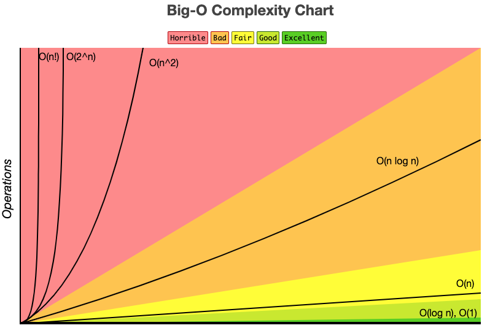
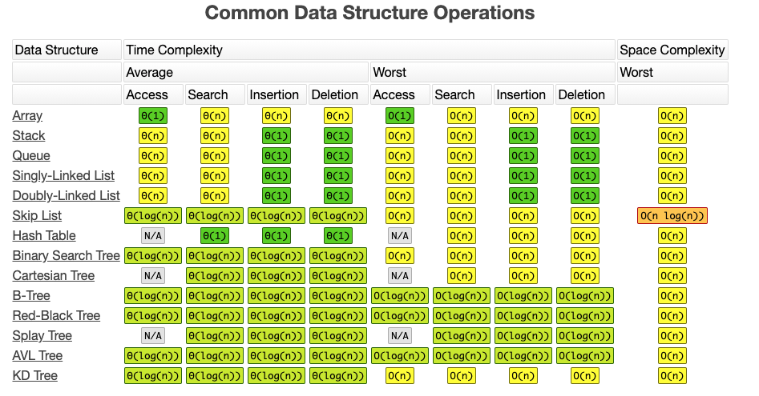
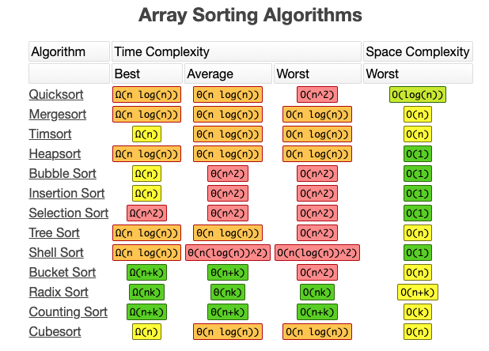

# Big

- What is Big O?
    
    It is the language we use for talking about how long an algorithm takes to run. It's how we compare the efficiency of different approaches to a problem.
    
- [Big-O Complexity Chart](https://www.bigocheatsheet.com/)
    
    
    
- Common Data Structure Operations
    
    
    
- Array Sorting Algorithms
    
    